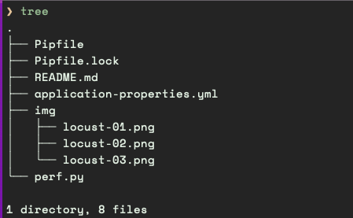
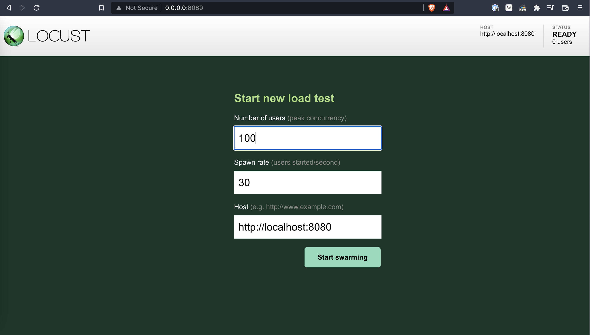
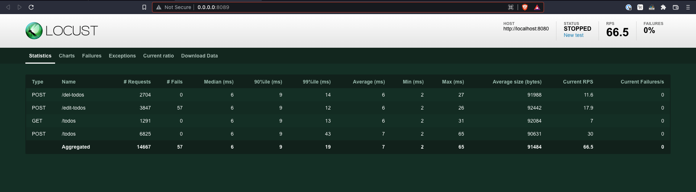
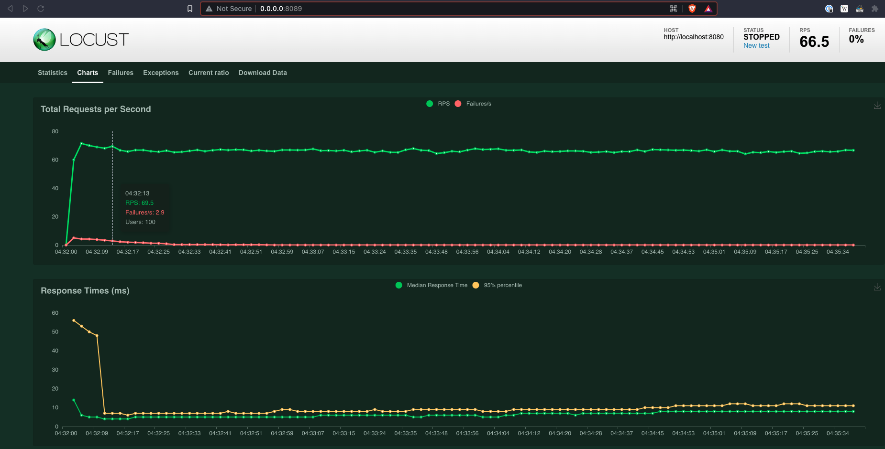
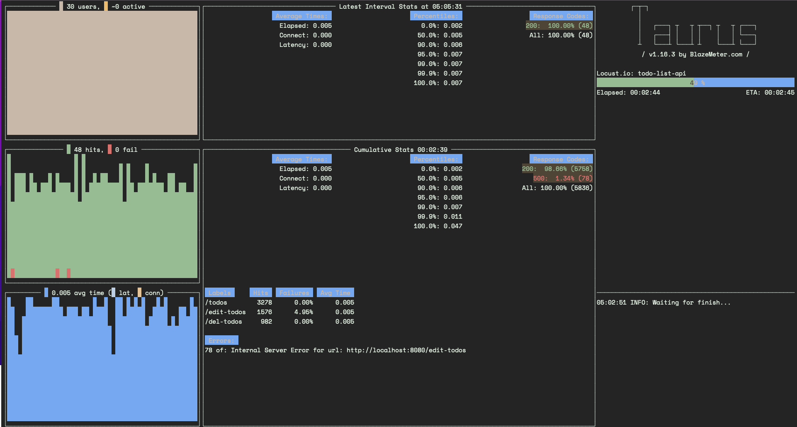
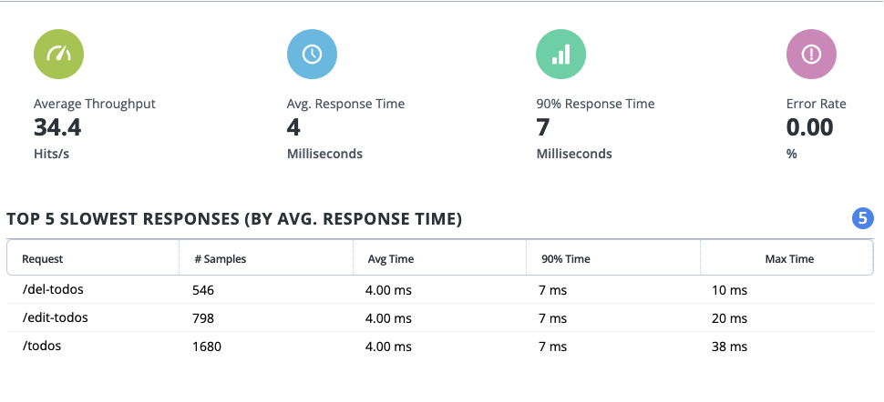

# Performance Testing 📉
Solution to the [Stitch.Money](https://stitch.money/) Quality Engineer assessment - **Performance Testing**.

## What is the purpose of this assessment?
> The purpose of this assessment is to determine the performance of the application. One key thing is ensuring that the app can handle adding 10 todo items per second.


Once you `clone` and `cd` into the directory, it should look like:



The perf tests will run against the [TODO List (API)](https://github.com/Stitch-Money/Todo-list-api) since the 
[Frontend application](https://github.com/Stitch-Money/todo-front-end) relies on the API 
for its core functionalities, i.e. _adding_, and _viewing todos_. 


We will use both  [Locust](https://locust.io/) and [Taurus](https://gettaurus.org/) 
for the perf tests - they play well together... and Python 🐍 excels as a tool 
for quick scripting and/or proof of concept.

(Locust)

`locust -f perf.py --host http://localhost:8080`







(Taurus)

`bzt application-properties.yml`



`bzt application-properties.yml -report`



#### Requirements
- [Python 3.9](https://www.python.org/downloads/release/python-3912/)
- [Pipenv](https://pipenv.readthedocs.io/en/latest/)

You need to have the [backend application](https://github.com/Stitch-Money/Todo-list-api) running
(information on how to do this can be found in the
[README](https://github.com/Stitch-Money/Todo-list-api/blob/main/README.md)).

**NOTE**: You can change the TODO app's url and/or port in the 
[application-properties.yml](application-properties.yml#L21) file.

###### How to run tests?
```bash
$ git clone https://gitlab.com/clovis.mugaruka/interviews.git
$ cd interviews/stitch.money/quality_engineer/perf_testing
$ pipenv install
$ pipenv shell
$ bzt application-properties.yml -report
```

Build with ❤️ 🇨🇩
©️ 2022 Clovis Mugaruka
