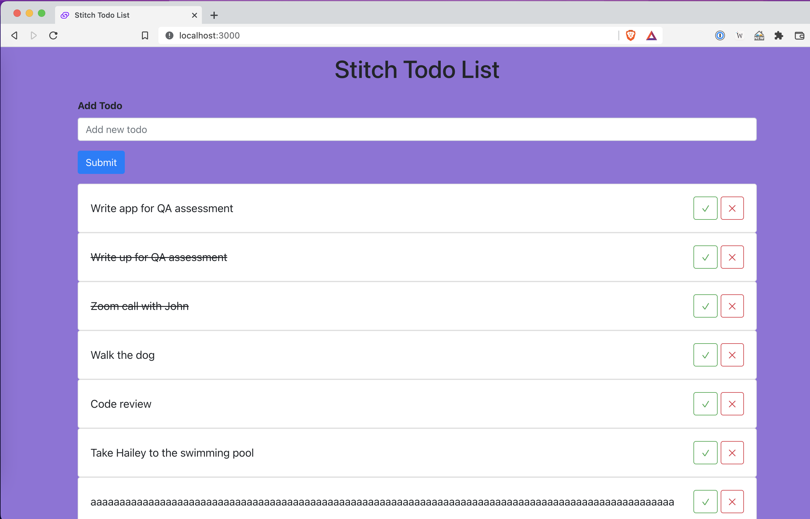
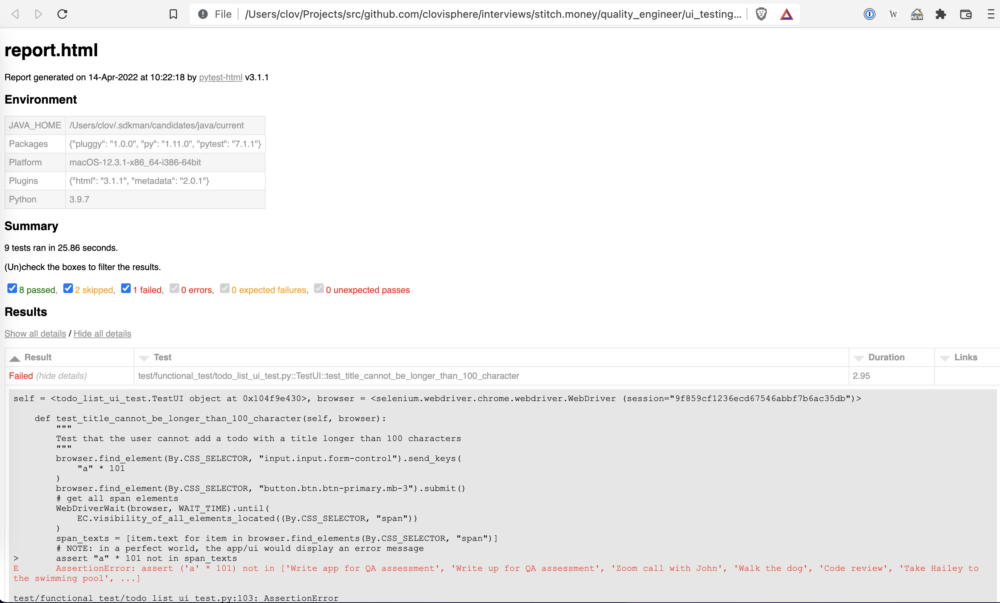

# UI Testing 🌉
Solution to the [Stitch.Money](https://stitch.money) Quality Engineering assessment - **UI Automated Testing**.

## What is the purpose of this project?
> The purpose of this project is to automate the testing of the TODO List website.

#### Test Ideas
1. The user is able to add a new task to the list.
2. The user is able to edit a task in the list.
3. The user is able to delete a task from the list.
4. The user is able to mark a task as completed.
5. The user cannot add a task with an empty title.
6. The user cannot add a task with a title that is longer than 100 characters.
7. Completed tasks cannot be deleted.

#### A word on the tests

The tool of choice is Python 🐍 (once again 🤗), with the 
[Selenium WebDriver](https://selenium-python.readthedocs.io/) library and the  
[py.test](https://docs.pytest.org/en/7.1.x/) framework.

For these tests, I decided to add/create [5 todos](./test/functional_test/todo_list_ui_test.py#L27)...
You can add as many as you want. From the shared images (see below), 
you can see that we're able to add, delete and/or mark a task as completed.





**NOTE**:
1. I have ignored the [test_edit_todo](./test/functional_test/todo_list_ui_test.py#L137) as we can't edit a task from the UI, at the moment.
2. Although the [test_task_marked_as_completed_cannot_be_deleted](./test/functional_test/todo_list_ui_test.py#L121) works, I have also ignored it as I expected the app to display an error message when one tries to delete a completed task. 

#### Requirements
- Both [Python 3.9](https://www.python.org/downloads/release/python-3912/) and 
[Pipenv](https://pipenv.readthedocs.io/en/latest) are installed. 
- The [Backend](https://github.com/Stitch-Money/Todo-list-api) and [Frontend](https://github.com/Stitch-Money/todo-front-end) applications should be running.

**NOTE**: 

- Information on how to deploy the frontend app locally can be found [here](https://github.com/Stitch-Money/todo-front-end/blob/main/README.md), for the backend, 
use [this guide](https://github.com/Stitch-Money/Todo-list-api/blob/main/README.md).
- You can change the url and/or port of the application under test (the Frontend app, in our case) [here](./test/functional_test/todo_list_ui_test.py#L19).

###### How to run tests?

Install dependencies:
```bash
$ git clone https://gitlab.com/clovis.mugaruka/interviews.git
$ cd interviews/stitch.money/quality_engineer/ui_testing
$ pipenv install
$ pipenv shell
```

👇 To run the tests, run any of the below commands:

(1) The easy way
```bash
$ python -m py.test
```

(2) Beautiful report -- _a report.html file will be generated_
```bash
$ python -m py.test --html=report.html --self-contained-html
$ open report.html
```


Build with ❤️ 🇨🇩
©️ 2022 Clovis Mugaruka
