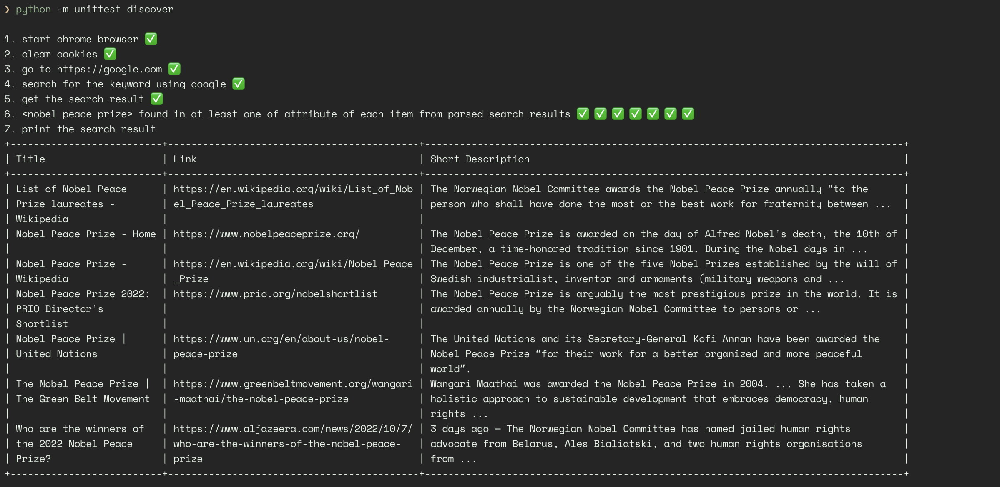

#  Upwork - QA Take Home Assessment
Solution to the [upwork](https://www.upwork.com/) Quality Engineering assessment - **UI Automation**.

## What is the purpose of this project?
> Automate 2 search engines (e.g. Google and another one per candidate's choice).

#### Requirements

- Both [Python 3.10](https://www.python.org/downloads/release/python-3107/) and 
[Pipenv](https://pipenv.readthedocs.io/en/latest) are installed. 




###### How to run tests?

Install dependencies:
```bash
$ cd git clone https://gitlab.com/clovis.mugaruka/interviews.git
$ cd interviews/upwork/quality_engineer/ui_testing
$ pipenv --python 3
$ pipenv install
$ pipenv shell
```

👇 To run the tests, run the below commands:

```bash
$ python -m unittest discover
```

A word on the [.env](./.env) file:

It can be used to change/specify the following variables:
```console
- BROWSER (we only suporting "chrome" or "firefox" at the moment)
- KEYWORD (e.g. "python")
```

Enjoy 🥳

Build with ❤️ 🇨🇩
©️ 2022 Clovis Mugaruka
